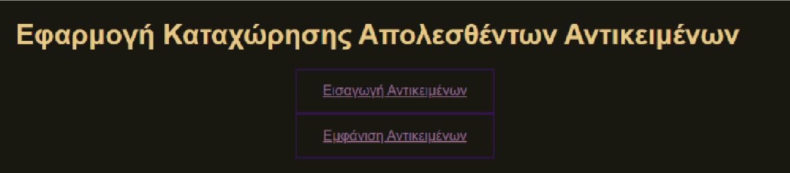
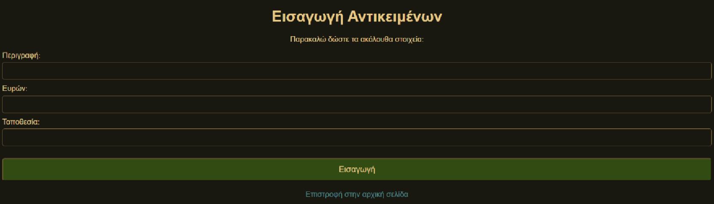
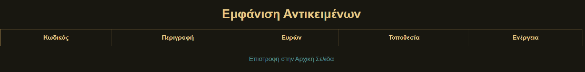

# 🛍️ Eφαρμογή απολεσθέντων αντικειμένων
Mια εφαρμογή για την καταχώρηση και παρουσίαση απολεσθέντων αντικειμένων.
Η εφαρμογή δημιουργήθηκε χρησιμοποιώντας τη βάση δεδομένων laf.db , τρεις σελίδες JSP και ένα Java servlet.
* H [index.jsp](index.jsp) είναι η αρχική σελίδα όπου έχει δύο συνδέσμους για τις σελίδες insert.jsp και view_all.jsp.

* Στην σελίδα [insert.jsp](insert.jsp) εισάγουμε το χαμένο αντικέιμενο και στην σελίδα view_all.jsp εμφανίζει τα δεδομένα σε πίνακα με δυνατότητα διαγραφής.

* Η αλληλουχία των λειτουργιών βασίζεται στην αποστολή αιτημάτων POST από τις σελίδες JSP προς τον [Controller.java](Controller.java), ο οποίος διαχειρίζεται τη λογική μέσω της κλάσης PreparedStatement για την ασφαλή επικοινωνία με τη βάση.

Ιδιαίτερη έμφαση δόθηκε στη διαχείριση σφαλμάτων στην insert.jsp, όπου ο Controller ανακατευθύνει τον χρήστη στην ίδια σελίδα μεταφέροντας τις τιμές των πεδίων ωςπαραμέτρους στο URL, επιτυγχάνοντας έτσι τη διατήρηση των αρχικών τιμών στηφόρμα σε περίπτωση αποτυχίας της εισαγωγής.
