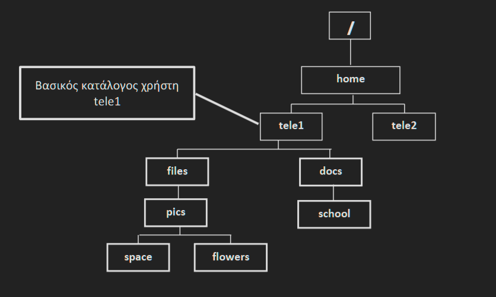

# Ερωτήματα ενότητας 1

Θεωρήστε την ακόλουθη δενδρική δομή του σχήματος. Οι κατάλογοι με αχνό περίγραμμα υπάρχουν ήδη στο σύστημα.

---
1. Δημιουργήστε τον κατάλογο files με χρήση απόλυτου ονόματος διαδρομής. Απάντηση: 
* mkdir /home/tele1/files
---
2. Δείτε ποιος είναι ο τρέχοντας κατάλογος. Απάντηση: 
* pwd
---
3. Δημιουργήστε τον κατάλογο docs με χρήση απόλυτου ονόματος διαδρομής. Απάντηση: 
* mkdir /home/tele1/docs
---
4. Δημιουργήστε τον κατάλογο pics με χρήση σχετικού ονόματος διαδρομής. Απάντηση: 
* mkdir files/pics
---
5. Θέστε ως τρέχοντα κατάλογο τον files και επαληθεύστε το. Απάντηση: 
* cd files
---
6. Δημιουργήστε τον κατάλογο school με χρήση σχετικού ονόματος διαδρομής. Απάντηση: 
* mkdir ../docs/school
---
7. Δημιουργήστε τον κατάλογο space με χρήση απόλυτου ονόματος διαδρομής. Απάντηση: 
* mkdir /home/tele1/files/pics/space
---
8. Θέστε ως τρέχοντα κατάλογο τον school. Απάντηση: 
* cd ../docs/school
---
9. Δημιουργήστε τον κατάλογο flowers με χρήση σχετικού ονόματος διαδρομής. Απάντηση: 
* mkdir ../../files/pics/flowers
---
10. Εμφανίστε στην οθόνη το ημερολόγιο του Μαΐου του 2012 καθώς και τη σημερινή ημερομηνία. Απάντηση: 
* cal 5 2012
* date   
---
