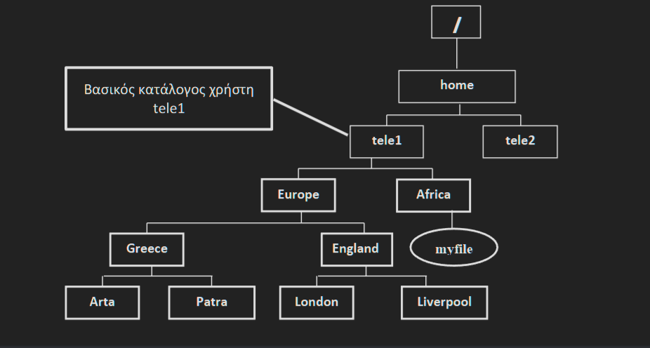

# Ερωτήματα ενότητας 2

Θεωρήστε την ακόλουθη δενδρική δομή του σχήματος. Οι κατάλογοι με αχνό περίγραμμα υπάρχουν ήδη στο σύστημα.

---
1. Δημιουργήστε τους παραπάνω καταλόγους (παραλληλόγραμμα με έντονο περίγραμμα). Απάντηση:
* mkdir /home/tele1/Europe
* mkdir Africa
* mkdir /home/tele1/Europe/Greece
* mkdir Europe/England
* mkdir /home/tele1/Europe/Greece/Patra
* mkdir /home/tele1/Europe/Greece/Arta
* mkdir Europe/England/London
* mkdir Europe/England/Liverpool
---
2. Κάντε τρέχοντα κατάλογο τον Greece και επαληθεύστε το. Απάντηση: 
* cd /home/tele1/Europe/Greece
* pwd (επαλήθευση)
---  
3. Δώστε την εντολή touch /home/tele1/Africa/myfile για να κατασκευάσετε το αρχείο myfile. Απάντηση: 
* touch /home/tele1/Africa/myfile
---
4. Μετακινήστε τον κατάλογο Arta στον κατάλογο Europe με σχετικό μονοπάτι. Απάντηση: 
* mv Arta ..
---
5. Δείτε ότι έγινε η μετακίνηση με απόλυτο μονοπάτι. Απάντηση: 
* ls /home/tele1/Europe
---
6. Αντιγράψτε τους κατάλογους England και Patra στον κατάλογο Africa με σχετικό μονοπάτι. Απάντηση: 
* cp –r ../England Patra ../../Africa
---
7. Δείτε όλα τα περιεχόμενα του Africa και των υποκαταλόγων του καθώς και τα κρυφά αρχεία και τα δικαιώματα τους με απόλυτο μονοπάτι. Απάντηση: 
* ls –Rla /home/tele1/Africa
---
8. Αντιγράψτε το αρχείο myfile στον κατάλογο Liverpool με όνομα newfile μεαπόλυτο μονοπάτι. Απάντηση: 
* cp /home/tele1/Africa/myfile
* /home/tele1/Europe/England/Liverpool/newfile
---
9. Διαγράψτε τον κατάλογο Africa.  Απάντηση:
* rm –r ../../Africa
---
