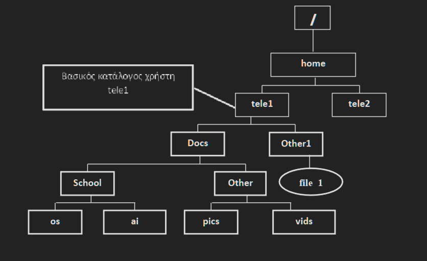

# Ερωτήματα ενότητας 3

Θεωρήστε την ακόλουθη δενδρική δομή του σχήματος. Οι κατάλογοι με αχνό περίγραμμα υπάρχουν ήδη στο σύστημα.

---
1. Δημιουργήστε τους παραπάνω καταλόγους (παραλληλόγραμμα με έντονο περίγραμμα). Απάντηση:
* mkdir /home/tele1/Docs
* mkdir Other1
* mkdir /home/tele1/Docs/School
* mkdir Docs/Other
* mkdir /home/tele1/Docs/School/os
* mkdir /home/tele1/Docs/School/ai
* mkdir Docs/Other/vids
* mkdir Docs/Other/pics
---

2. Δώστε την εντολή touch /home/tele1/Other1/file_1 για να κατασκευάσετε το αρχείο file_1. Απάντηση: 
* touch /home/tele1/Other1/file_1
---  
3. Δείτε τα δικαιώματα των περιεχομένων του καταλόγου Docs. Απάντηση: 
* ls –l /home/tele1/Docs
---
4. Δώστε τα εξής δικαιώματα στον κατάλογο Other: user:r,x, group:r,x, others:r, με τον Α’ (αριθμητικό) τρόπο. Επαληθεύστε την αλλαγή. Απάντηση: 
* chmod 554 Docs/Other
* ls –l Docs (επαλήθευση)
---
5. Διαγράψτε τον κατάλογο pics. Τι παρατηρείτε; Δώστε το κατάλληλο δικαίωμα(προσοχή σε ποιον κατάλογο θα δώσετε το δικαίωμα), με το Β’ (συμβολοσειρά mode) τρόπο, ώστε να είναι εφικτή η διαγραφή. Απάντηση: 
* rmdir /home/tele1/Docs/Other/pics
* chmod u+w /home/tele1/Docs/Other
---
6. Με βάση τα τρέχοντα δικαιώματα (ls –l για να τα δείτε) του αρχείου file_1, να κάνετε τις κατάλληλες αλλαγές στα δικαιώματα, με το Β’ τρόπο, ώστε οι others να μην μπορούν να το διαβάσουν και το group να μπορεί να τροποποιεί τα περιεχόμενά του. Επαληθεύστε την αλλαγή. Απάντηση: 
* chmod g+w,o-r Other1/file_1
---
7. Δώστε τα εξής δικαιώματα στον κατάλογο ai: user:r,w, group:x others:r,x, με τον Α’ τρόπο. Επαληθεύστε την αλλαγή. Απάντηση: 
* chmod 615 /home/tele1/Docs/School/ai
* ls –l /home/tele1/Docs/School (επαλήθευση)
---
8. Αντιγράψτε το αρχείο file_1 στον κατάλογο ai. Τι παρατηρείτε; Δώστε τοκατάλληλο δικαίωμα, με το Β’ τρόπο, ώστε να είναι εφικτή η αντιγραφή. Απάντηση: 
* cp Other1/file_1 /home/tele1/Docs/School/ai
* chmod u+x /home/tele1/Docs/School/ai
---
