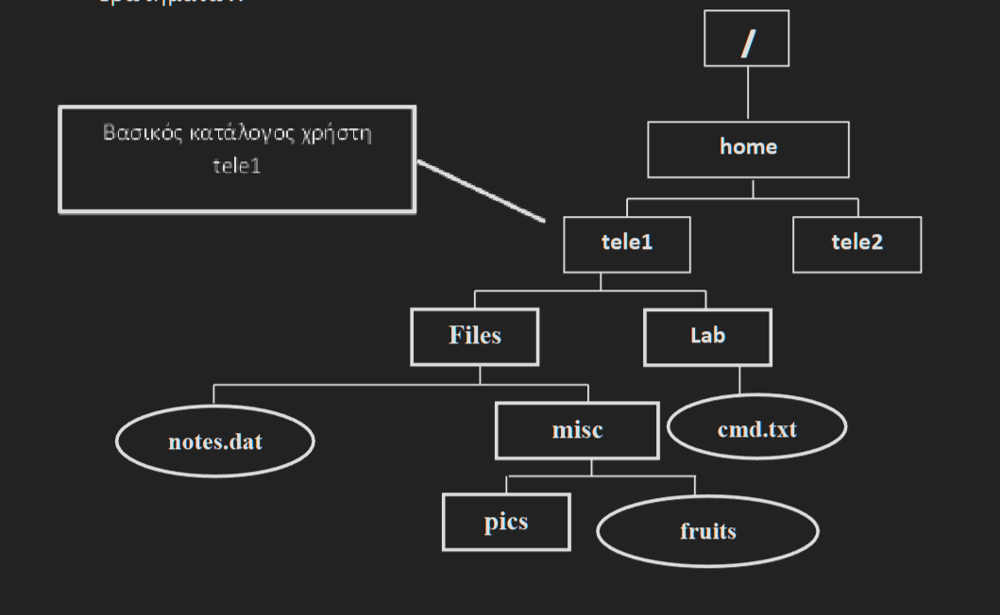

# Ερωτήματα ενότητας 4

Θεωρήστε την ακόλουθη δενδρική δομή του σχήματος. Οι κατάλογοι με αχνό περίγραμμα υπάρχουν ήδη στο σύστημα.

---
1. Δημιουργήστε τους παραπάνω καταλόγους (παραλληλόγραμμα με έντονο περίγραμμα). Απάντηση:
* mkdir /home/tele1/Files
* mkdir Labmkdir Files/misc
* mkdir /home/tele1/Files/misc/pics
---

2. Δημιουργήστε τα αρχεία (ελλείψεις με έντονο περίγραμμα). Στο αρχείο fruits προσθέστε τα εξής περιεχόμενα: Giorgos orange, Nikos ???, Anna apple, Barbara fig, Agni banana και επαληθεύστε ότι προστέθηκαν. Απάντηση: 
* touch Lab/cmd.txt
* cat > /home/tele1/Files/notes.dat (πατούμε Ctrl-D)
* cat > Files/misc/fruits
* Giorgos orange
* Nikos ???
* Anna apple
* Barbara fig
* Agni banana (πατούμε Ctrl-D)
* cat Files/misc/fruits
---  
3. Κάντε τρέχοντα κατάλογο τον Lab. Απάντηση: 
* cd /home/tele1/Lab
---
4. Δείτε τις τρεις πρώτες γραμμές και τους δέκα τελευταίους χαρακτήρες του αρχείου fruits (με σχετικό όνομα διαδρομής). Απάντηση: 
* head -3 ../Files/misc/fruits
* tail -10c ../Files/misc/fruits
---
5. Δείτε το πλήθος λέξεων και χαρακτήρων του αρχείου fruits (με απόλυτο όνομα διαδρομής). Απάντηση: 
* wc –wc /home/tele1/Files/misc/fruits
---
6. Δημιουργήστε σύνδεσμο για το αρχείο fruits στον κατάλογο pics (με σχετικό όνομα διαδρομής). Απάντηση: 
* ln –s ../fruits ../Files/misc/pics
---
7. Προσθέστε στο αρχείο fruits τη γραμμή: Giannis cherry. Απάντηση: 
* cat >> ../Files/misc/fruits
* Giannis cherry (πατούμε Ctrl-D)
---
8. Μετρήστε το πλήθος χαρακτήρων που υπάρχουν μεταξύ δεύτερης και τέταρτης γραμμής του αρχείου fruits. Απάντηση: 
* head -4 /home/tele1/Files/misc/fruits | tail -3 | wc –c
* Εναλλακτικά: head -4 /home/tele1/Files/misc/fruits | tail +2 | wc –c
* tail +2 /home/tele1/Files/misc/fruits | head -3 | wc –c
---
9. Αποθηκεύστε στο αρχείο notes.dat τα περιεχόμενα του αρχείου fruits πουβρίσκονται από τη τρίτη γραμμή και κάτω. Απάντηση: 
* tail +3 ../Files/misc/fruits >> ../Files/notes.dat
---
10. Προσθέστε στο αρχείο fruits τη γραμμή: Giannis cherry. Απάντηση: 
* cat >> ../Files/misc/fruits
* Giannis cherry (πατούμε Ctrl-D)
---
