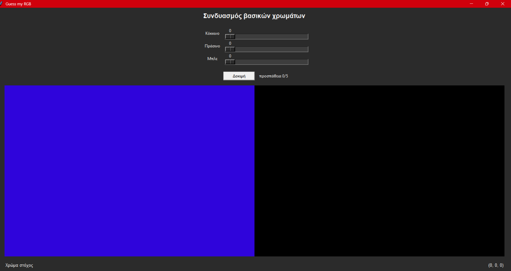

# 🔴🟢🔵RGB Guessing Game 🔴🟢🔵
---
Αυτή η εφαρμογή αποτελεί μια υλοποίηση ενός παιχνιδιού εύρεσης χρωμάτων, βασισμένη στην ιδέα "Guess my RGB".

Περιγραφή
-----------------
Στόχος Παιχνιδιού: Nα εντοπίσει ένα τυχαία επιλεγμένο "Χρώμα Στόχο" μετακινώντας τρεις sliders που ελέγχουν τις βασικές τιμές RGB.

Κανόνες Παιχνιδιού: Ο χρήστης έχει έως 5 προσπάθειες. Για κάθε προσπάθεια υπολογίζεται η απόσταση μεταξύ του επιλεγμένου χρώματος και του στόχου.
* Νίκη: Ο χρήστης κερδίζει αν καταφέρει να πλησιάσει το χρώμα σε απόσταση 10% ή λιγότερο
* Ήττα: Αν εξαντληθούν οι προσπάθειες χωρίς να επιτευχθεί το απαιτούμενο ποσοστό εγγύτητας

Τεχνικά Χαρακτηριστικά
-----------------
* Γλώσσα Προγραμματισμού: Python
* Βιβλιοθήκη GUI: tkinter
* Linter & Formatter: ruff για τη διασφάλιση της ποιότητας και της ομοιομορφίας του κώδικα

Δομή Αρχείων:
-----------------
* [rgb_game.py](rgb_game.py): Το κύριο αρχείο που περιλαμβάνει τη λειτουργικότητα του GUI και τη διαχείριση γεγονότων
* [utils.py](utils.py): Βοηθητικό module με τις μαθηματικές συναρτήσεις για τον υπολογισμό της Ευκλείδειας απόστασης των χρωμάτων

