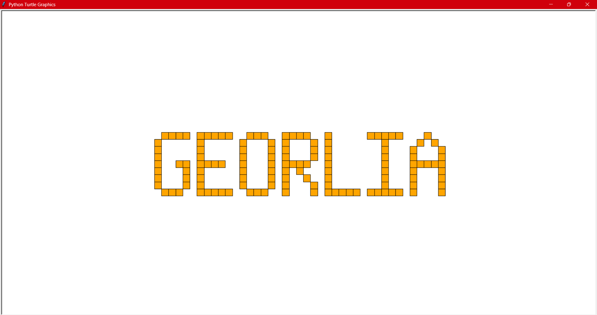
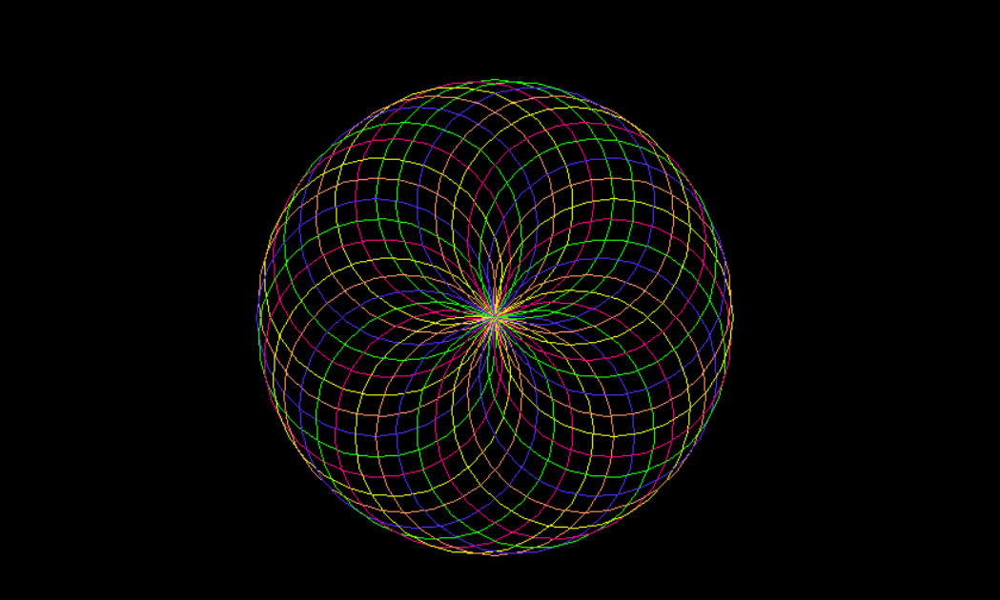
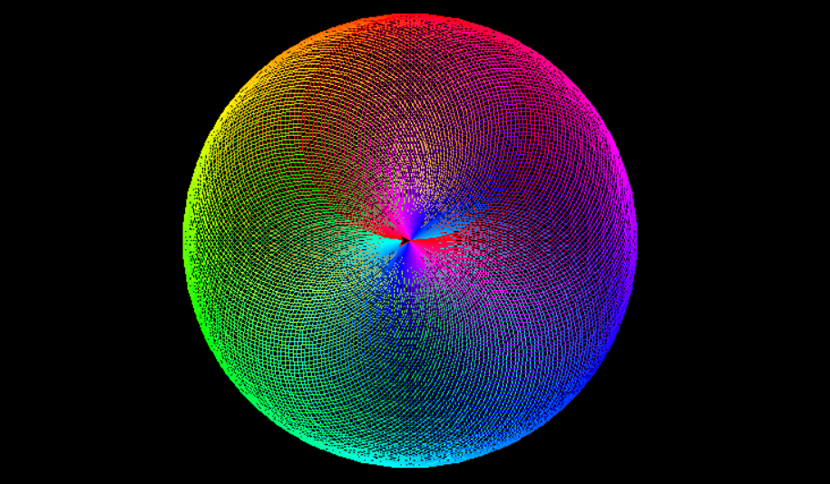

# 👾1)Pixel Art 

Ένα πρόγραμμα που σχεδιάζει το όνομα του χρήστη χρησιμοποιώντας pixels μέσω της βιβλιοθήκης turtle.[data.py](data.py), [pythonex.py](pythonex.py)

# 💐2)The Blooming Flower 
Creating a flower by drawing several overlapping circles and rotating the turtle slightly after each one.
[flower.py](flower.py)

# ⚪3)The Circle Illusion
Vibrant rainbow circles overlap continuously, creating a mesmerizing, three-dimensional donut shape that looks like a glowing, neon-colored geometric silk spirograph.
[circle_illusion.py](circle_illusion.py)

Made in python language and turtle library.
