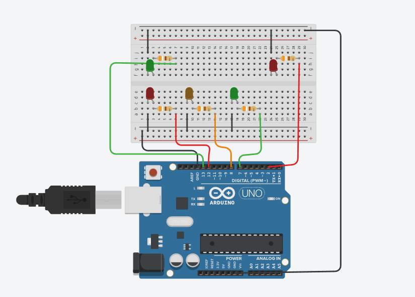
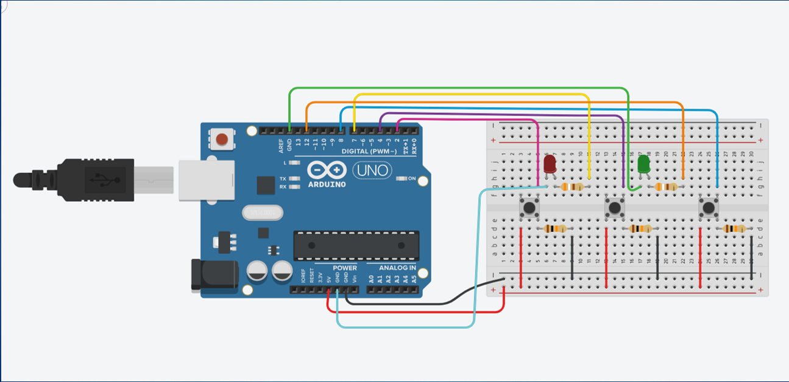
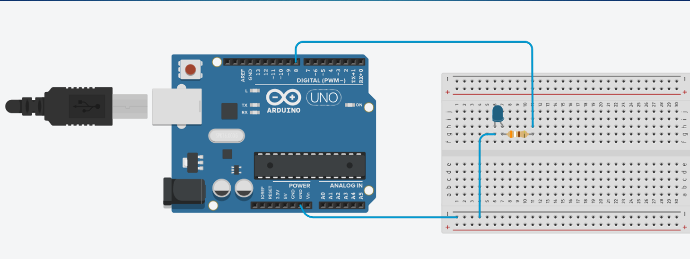

# ⚙️Tinkercad project 1

🚦Ερώτημα 1
---
Ένα πρόγραμμα που θα δείχνει την λειτουργία των φαναριών κυκλοφορίας και θα εμφανίζει κάποια προειδοποιητικά μηνύματα. 
Αν ο χρήστης εισάγει την λέξη stop, τα φανάρια πρέπει να γίνουν κόκκινα και τα φανάρια των πεζών να γίνουν πράσινα. [erotima1.ino](erotima1.ino)

🔒Ερώτημα 2
---
Ένα πρόγραμμα που θα υλοποιεί την λειτουργία ενός συστήματος κλειδαριάς και θα έχει τρία κουμπιά (αριθμοί 1,2,3).
Όταν ο χρήστης βάλει τον σωστό συνδυασμό, ένα πράσινο led θα ανάβει και όταν βάλει τον λάθος συνδυασμό ανάβει ένα κόκκινο led. [erotima2.ino](erotima2.ino)

💡Ερώτημα 3
---
Ένα πρόγραμμα που θα παράγει τιμές εύρους 0-255 και θα ρυθμίζει ανάλογα με τον αριθμό την φωτεινότητα του led. [erotima3.ino](erotima3.ino)

