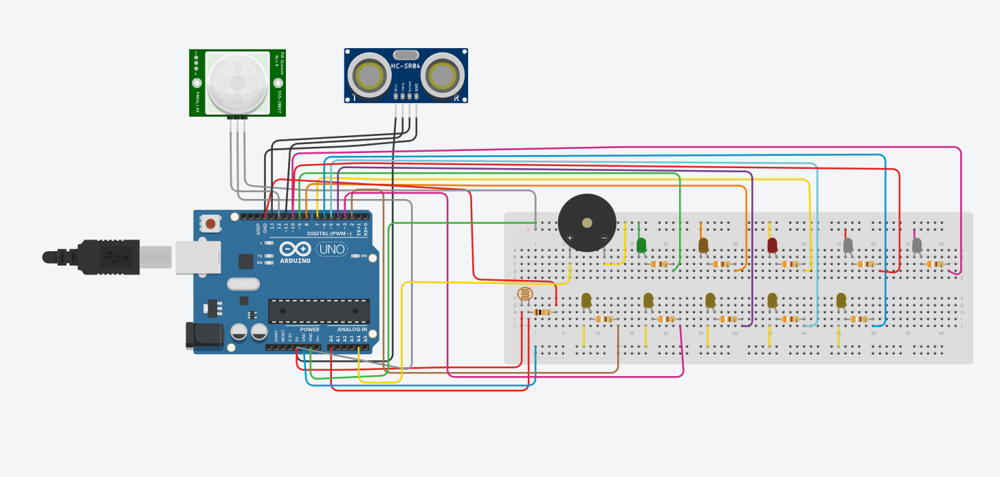

# 🌇Tinkercad project 3: Έξυπνη Πόλη
Ένα πρόγραμμα που θα υλοποιήσει ένα μέρος μιας Έξυπνης Πόλης και θα διαθέτει έναν αισθητήρα ανίχνευσης φωτός (Photoresistor), έναν αισθητήρα απόστασης (Ultrasonic Sensor HC-SR04),
έναv αισθητήρα ανίχνευσης κίνησης (PIR Sensor) και εμφανίζει στο χρήστη προειδοποιητικά μηνύματα.

Ο κώδικας σχεδιάστηκε και μεταγλωττίστηκε στην έκδοση Arduino IDE. 1.8.16. [code.ino](code.ino)

Σχεδιάστηκε για χρήση με το Arduino UNO R3 ATmega328P.

  
