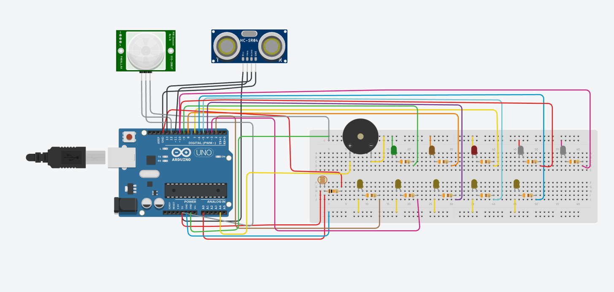
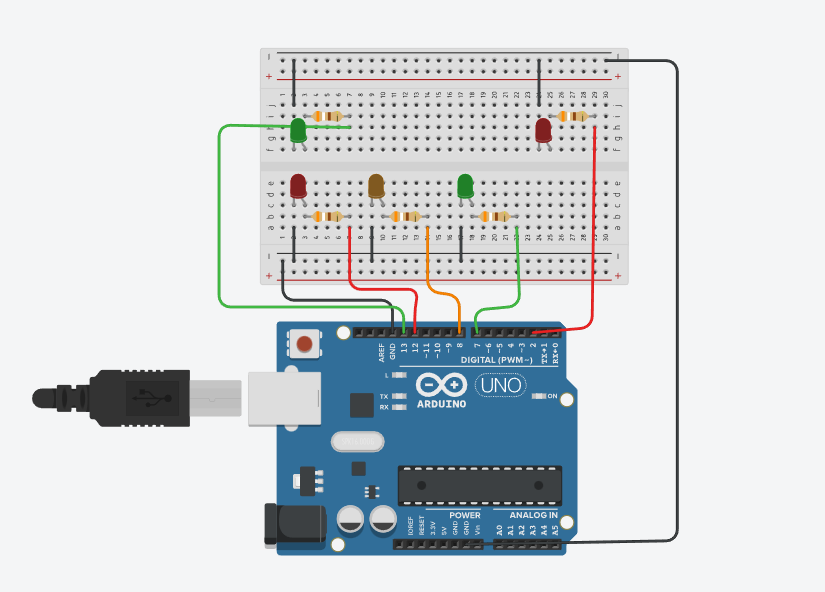
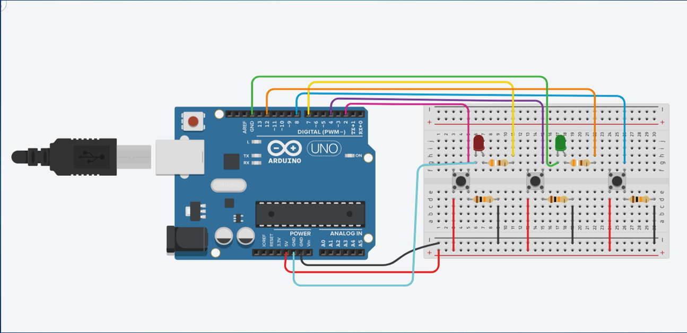
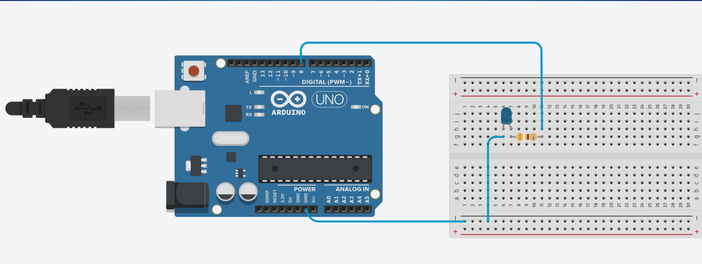

# 🚦Traffic lights
Ένα πρόγραμμα που θα δείχνει την λειτουργία των φαναριών κυκλοφορίας και θα εμφανίζει κάποια προειδοποιητικά μηνύματα. 
Αν ο χρήστης εισάγει την λέξη stop, τα φανάρια πρέπει να γίνουν κόκκινα και τα φανάρια των πεζών να γίνουν πράσινα. [Code](traffic_light.ino)

# 🔒Κλειδαριά
Ένα πρόγραμμα που θα υλοποιεί την λειτουργία ενός συστήματος κλειδαριάς και θα έχει τρία κουμπιά (αριθμοί 1,2,3).
Όταν ο χρήστης βάλει τον σωστό συνδυασμό, ένα πράσινο led θα ανάβει και όταν βάλει τον λάθος συνδυασμό ανάβει ένα κόκκινο led. [Code](lock.ino)

# 💡Led
Ένα πρόγραμμα που θα παράγει τιμές εύρους 0-255 και θα ρυθμίζει ανάλογα με τον αριθμό την φωτεινότητα του led. [Code](led.ino)

# 🌇Έξυπνη Πόλη
Ένα πρόγραμμα που θα υλοποιήσει ένα μέρος μιας Έξυπνης Πόλης και θα διαθέτει έναν αισθητήρα ανίχνευσης φωτός (Photoresistor), έναν αισθητήρα απόστασης (Ultrasonic Sensor HC-SR04),
έναv αισθητήρα ανίχνευσης κίνησης (PIR Sensor) και εμφανίζει στο χρήστη προειδοποιητικά μηνύματα.

Ο κώδικας σχεδιάστηκε και μεταγλωττίστηκε στην έκδοση Arduino IDE. 1.8.16.Σχεδιάστηκε για χρήση με το Arduino UNO R3 ATmega328P. [Code](smart_city.ino)

  
