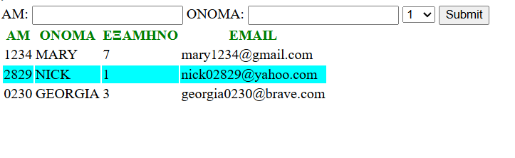
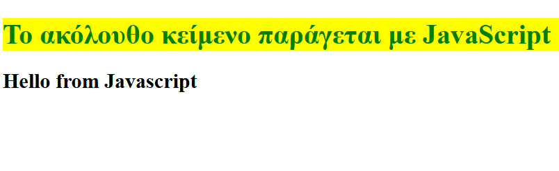
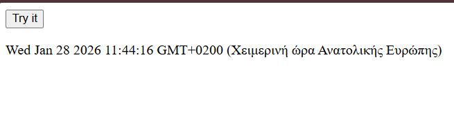
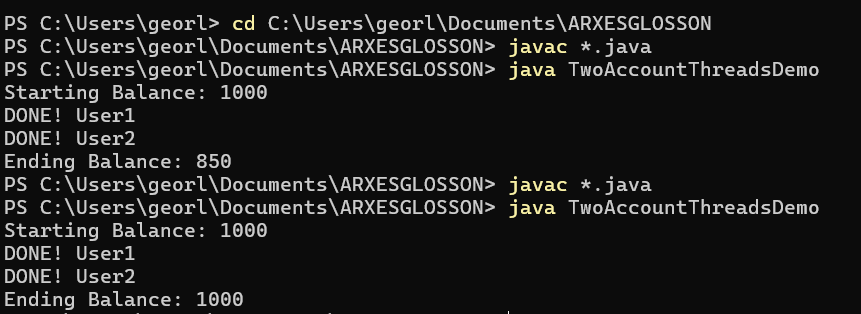
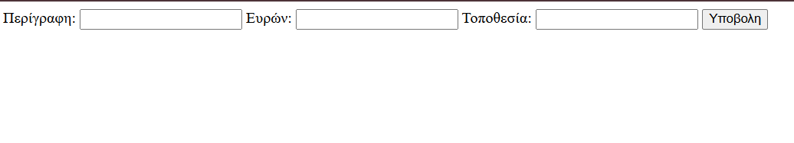

# 🌐Τεχνολογίες Εφαρμογών Διαδικτύου

ΑΣΚΗΣΗ 1: HTML & CSS
---
Μια φόρμα που περιέχει δύο πεδία κειμένου με τίτλο ΑΜ και Επώνυμο και μια λίστα επιλογής εξαμήνων. Επίσης υπάρχει το κουμπί submit με το οποίο δημιουργείται ένας πίνακα με τα στοιχεία τριών φοιτητών:Αριθμός Μητρώου, Όνομα,Εξάμηνο,Email. [askisi1.html](askisi1.html)

ΑΣΚΗΣΗ 2: JAVASCRIPT
---
Ένα αρχείο JavaScript με όνομα askisi2.js το οποίο να τοποθετεί στο συστατικό h2 του προηγούμενου εγγράφου το κείμενο ”Hello from Javascript” και να εμφανίζει το κείμενο της επικεφαλίδας h1 με πράσινο χρώμα σε κίτρινο φόντο. [askisi2.html](askisi2.html) , [askisi2.js](askisi2.js)

ΑΣΚΗΣΗ 3 ΕΡΩΤΗΜΑ 1: JAVASCRIPT
---
Στον ακόλουθο κώδικα προσθέστε μια ιδιότητα onclick στο κουμπί ώστε να καλείται η συνάρτηση myFunction όταν το πατάμε. [askisi3_question1.html](askisi3_question1.html)

ΑΣΚΗΣΗ 3 ΕΡΩΤΗΜΑ 2: JAVASCRIPT
---
Στον ακόλουθο κώδικα προσθέστε το χειρισμό ενός συμβάντος onclick με χρήση του DOM, το οποίο να καλεί τη συνάρτηση displayDate(). [askisi3_question2.html](askisi3_question2.html)

ΑΣΚΗΣΗ 3 ΕΡΩΤΗΜΑ 3: JAVASCRIPT
---
Διορθώστε τον ακόλουθο κώδικα ώστε όταν τοποθετείτε τον κέρσορα στο κείμενο να αλλάξει χρώμα. [askisi3_question3.html](askisi3_question3.html)

ΑΣΚΗΣΗ 4: THREADS (Java Concurrency Control)
---
Υπάρχουν τρία αρχεία: Account.java, AccountThread.java, TwoAccountsThreadDemo.java.
- Το [askisi4_Account.java](askisi4_Account.java) περιέχει την κλάση Account η οποία χρησιμοποιείται για την δημιουργία αντικειμένων χρηματικών λογαριασμών. 
- Το [askisi4_AccountThread.java](askisi4_AccountThread.java) περιέχει το καθορισμό ενός προγράμματος που προσομοιώνει μια σειρά συναλλαγών σε ένα αντικείμενο Account.
- Το [askisi4_TwoAccountThreadsDemo.java](askisi4_TwoAccountThreadsDemo.java) περιέχει την κλάση με την μέθοδο main για την εκκίνηση της εφαρμογής. 

Οδηγίες:
* Κατεβάστε τα αρχεία και θέστε σαν τρέχοντα κατάλογο τον φάκελο εργασίας σας (`εντολή cd`).
* Μεταφράστε τις κλάσεις java με την εντολή `javac *.java` . Αν το πρόγραμμα javac δεν αναγνωρίζεται από την γραμμή εντολών γράψετε όλο το μονοπάτι(π.χ "c:\Program Files\Java\jdk1.8.0_101\bin\javac" *.java).
* Όταν η μετάφραση ολοκληρωθεί σωστά θα πρέπει να υπάρχουν τρία αρχεία με την κατάληξη .class στο φάκελο εργασίας σας
* Εκτελέστε το πρόγραμμα με την εντολή:`java TwoAccountThreadsDemo`.

Πρόβλημα:
Θα παρατηρήσετε ότι το αρχικό και το τελικό υπόλοιπο του λογαριασμού είναι διαφορετικά. Εκτελέστε το πρόγραμμα περισσότερες φορές και θα παρατηρήσετε ότι το τελικό υπόλοιπο θα διαφέρει από το αρχικό.
  
Διόρθωση του Προβλήματος:
**Βάλε synchronized μπροστα στα void στο αρχειο Account.java**

ΑΣΚΗΣΗ 5: HTML
---
Mια φόρμα που θα συλλέγει τις πληροφορίες ενός αντικειμένου και θα τις εισάγει στον πίνακα. Θα περιέχει τρία πεδία κειμένου στα οποία ο χρήστης θα εισάγει την περιγραφή, τον ευρόντα και την τοποθεσία που ανευρέθηκε το αντικείμενο. 

