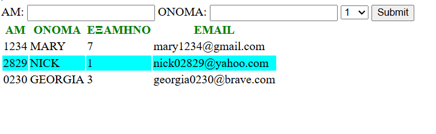
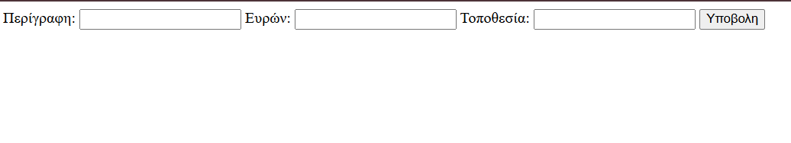

# 🌐Τεχνολογίες Εφαρμογών Διαδικτύου

ΑΣΚΗΣΗ 1: HTML & CSS
---
Μια φόρμα που περιέχει δύο πεδία κειμένου με τίτλο ΑΜ και Επώνυμο και μια λίστα επιλογής εξαμήνων. Επίσης υπάρχει το κουμπί submit με το οποίο δημιουργείται ένας πίνακα με τα στοιχεία τριών φοιτητών:Αριθμός Μητρώου, Όνομα,Εξάμηνο,Email. [askisi1.html](askisi1.html)

ΑΣΚΗΣΗ 5: HTML
---
Mια φόρμα που θα συλλέγει τις πληροφορίες ενός αντικειμένου και θα τις εισάγει στον πίνακα. Θα περιέχει τρία πεδία κειμένου στα οποία ο χρήστης θα εισάγει την περιγραφή, τον ευρόντα και την τοποθεσία που ανευρέθηκε το αντικείμενο. 

